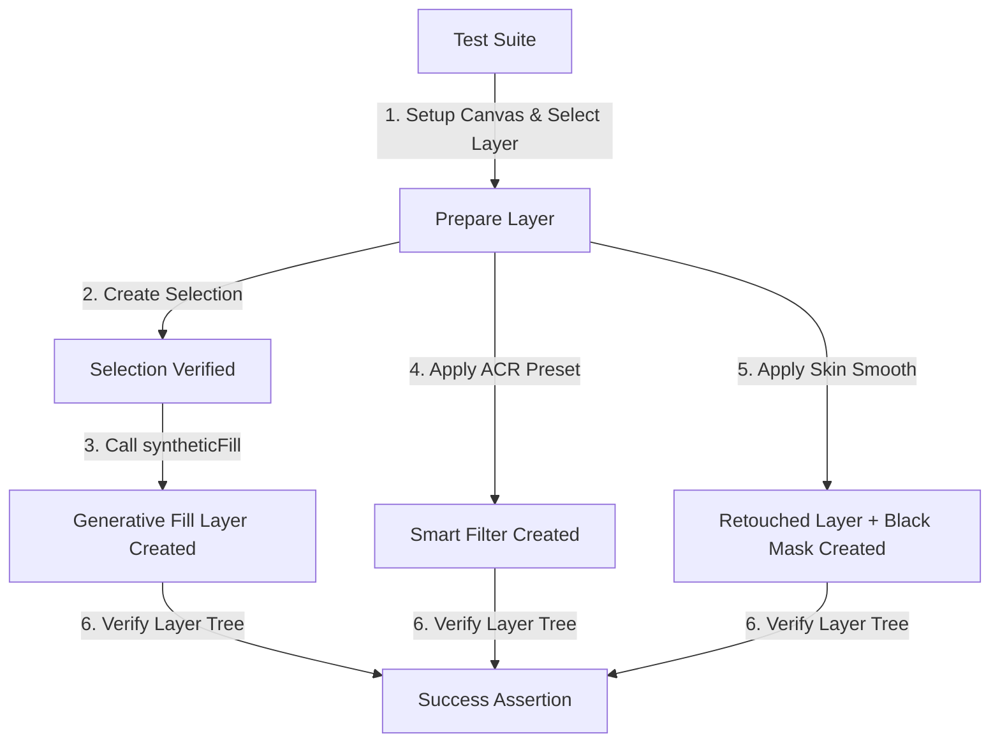

# Phase 06: 高级滤镜与人像美化 (Filters & Retouching) - Technical Research

本调研文档针对 Phase 06 中的高级滤镜和人像美化需求进行底层可行性分析、ExtendScript 与 ActionManager 接口映射，以确定可靠的开发规划。

---

## 1. 需求映射与技术概览

本阶段要实现的核心需求如下：
- **FIL-01**: 模糊与锐化滤镜 (高斯模糊、表面模糊、USM 锐化)
- **FIL-02**: 液化滤镜 (交互唤起形体调整)
- **FIL-03**: Camera Raw 滤镜 (应用外部/内置 `.xmp` 调色预设)
- **AI-01**: Neural Filters (神经网络滤镜唤起与优雅降级)
- **AI-02**: 经典商业磨皮动作流 (高反差保留 + 表面模糊 + 黑色全隐蒙版)
- **AI-03**: 生成式填充 (Generative Fill，无选区强拦截与提示词扩充)

---

## 2. 核心功能实现方案与 ActionManager JSX 脚本

Photoshop DOM 对复杂滤镜的支持非常有限（例如没有表面模糊和 Camera Raw 滤镜的直接 API），因此必须使用 **ActionManager (ExecuteAction)** 管道实现。下面给出每项功能在 JSX 中的执行逻辑。

### 2.1 FIL-01: 模糊与锐化滤镜 (Blur & Sharpen)
- **高斯模糊 (Gaussian Blur)**: 可直接使用 DOM 方法，简洁高效。
  ```javascript
  app.activeDocument.activeLayer.applyGaussianBlur(5.0); // 默认半径 5.0
  ```
- **USM 锐化 (Unsharp Mask)**: 可直接使用 DOM 方法。
  ```javascript
  // 数量(%), 半径(像素), 阈值
  app.activeDocument.activeLayer.applyUnsharpMask(50.0, 1.0, 4);
  ```
- **表面模糊 (Surface Blur)**: DOM 未提供 API，必须使用 ActionManager。
  ```javascript
  function applySurfaceBlur(radius, threshold) {
      var desc = new ActionDescriptor();
      desc.putUnitDouble(stringIDToTypeID("radius"), stringIDToTypeID("pixelsUnit"), radius);
      desc.putInteger(stringIDToTypeID("threshold"), threshold);
      executeAction(stringIDToTypeID("surfaceBlur"), desc, DialogModes.NO);
  }
  ```

### 2.2 FIL-02: 液化滤镜 (Liquify)
液化网格是黑盒且与人脸的物理像素位置高度绑定，无法以固定的数值静默运行。
- **方案**: 对图层自动转换为智能对象（D-05），然后以交互方式（`DialogModes.ALL`）唤起液化面板，使用户能够在原生界面完成细微瘦脸和形体修改。
  ```javascript
  var idLqFy = charIDToTypeID("LqFy");
  executeAction(idLqFy, undefined, DialogModes.ALL); // 弹出液化窗口，阻塞等待用户操作
  ```

### 2.3 FIL-03: Camera Raw 滤镜与 `.xmp` 预设加载
- **关键突破**: 经研究，可以通过 ActionManager 将 `.xmp` 预设文件内容作为字符串参数传给 `Adobe Camera Raw Filter` 的 `"Sett"` (Settings) 键，以此实现静默或交互应用任何 XMP 预设。
- **JSX 核心代码**:
  ```javascript
  function applyCameraRawPreset(xmpString, showDialog) {
      var idACR = stringIDToTypeID("Adobe Camera Raw Filter");
      var desc = new ActionDescriptor();
      // 使用 Sett 键传入 XMP 预设内容
      desc.putString(charIDToTypeID("Sett"), xmpString);
      
      var dialogMode = showDialog ? DialogModes.ALL : DialogModes.NO;
      executeAction(idACR, desc, dialogMode);
  }
  ```
- **Python 封装逻辑**:
  1. 接收自定义 XMP 路径，若空则映射到内置预设文件（例如 `./resources/presets/film.xmp`）。
  2. 读取该 XMP 文本内容为字符串。
  3. 通过 `execute_jsx()` 执行上述脚本应用到当前图层。若该图层非智能对象，前置转换为智能对象以达成无损操作（D-05）。

### 2.4 AI-01: Neural Filters (神经网络滤镜)
由于 AI 神经元滤镜异步计算且模型保密性强，无法实现完全可靠的 headless 静默带参处理。
- **方案**: 使用 `"neuralFiltersCmd"` 或 `"neuralFilters"` 命令唤起滤镜侧边栏。若本地未登录或未安装对应模型引发异常，在 Python 端做严格捕获，引导大模型进行语义降级（降级至商业磨皮流程）。
  ```javascript
  function openNeuralFilters() {
      // 唤起神经网络滤镜面板
      executeAction(stringIDToTypeID("neuralFiltersCmd"), undefined, DialogModes.ALL);
  }
  ```

### 2.5 AI-02: 经典商业磨皮动作流 (Retouching Workflow)
经典的磨皮流基于**高频/低频分离**原理，全套 JSX 实现步骤如下：
1. 备份当前图层，重命名为 `[原图层名]_磨皮`（保证 D-04 安全机制）。
2. 将该图层的混合模式设为线性光 (`Linear Light`)。
3. 对该图层执行反相 (`Invert`)。
4. 应用高反差保留 (`High Pass`) 滤镜（隔离面部细微质感），半径根据分辨率自适应。
5. 应用表面模糊 (`Surface Blur`) 滤镜（平滑面部肤色块），参数自适应。
6. 新建一个“黑色全隐蒙版”（`Hide All Mask`），使得图像整体效果在默认状态下不外露。用户只需在 Photoshop 中使用白色软画笔在皮肤区域涂抹，即可实现精细、局部的商业磨皮效果。
- **JSX 核心脚本**:
  ```javascript
  (function() {
      var doc = app.activeDocument;
      var activeLyr = doc.activeLayer;
      
      // 1. 复制图层并激活
      var copyLyr = activeLyr.duplicate();
      copyLyr.name = activeLyr.name + "_磨皮";
      doc.activeLayer = copyLyr;
      
      // 2. 混合模式设置为线性光
      copyLyr.blendMode = BlendMode.LINEARLIGHT;
      
      // 3. 执行反相
      executeAction(charIDToTypeID("Invt"), undefined, DialogModes.NO);
      
      // 4. 应用高反差保留 (自适应半径，这里演示传入 3.0)
      var hpRadius = 3.0;
      var hpDesc = new ActionDescriptor();
      hpDesc.putUnitDouble(stringIDToTypeID("radius"), stringIDToTypeID("pixelsUnit"), hpRadius);
      executeAction(stringIDToTypeID("highPass"), hpDesc, DialogModes.NO);
      
      // 5. 应用表面模糊 (自适应半径 3.0, 阈值 10)
      var sbRadius = 3.0;
      var sbThreshold = 10;
      var sbDesc = new ActionDescriptor();
      sbDesc.putUnitDouble(stringIDToTypeID("radius"), stringIDToTypeID("pixelsUnit"), sbRadius);
      sbDesc.putInteger(stringIDToTypeID("threshold"), sbThreshold);
      executeAction(stringIDToTypeID("surfaceBlur"), sbDesc, DialogModes.NO);
      
      // 6. 添加黑色全隐蒙版 (Hide All)
      var idMk = charIDToTypeID("Mk  ");
      var maskDesc = new ActionDescriptor();
      maskDesc.putClass(charIDToTypeID("Nw  "), charIDToTypeID("Chnl"));
      var ref = new ActionReference();
      ref.putEnumerated(charIDToTypeID("Chnl"), charIDToTypeID("Chnl"), charIDToTypeID("Msk "));
      maskDesc.putReference(charIDToTypeID("At  "), ref);
      maskDesc.putEnumerated(charIDToTypeID("Usng"), charIDToTypeID("UsrM"), charIDToTypeID("HdAl")); // HdAl = Hide All
      executeAction(idMk, maskDesc, DialogModes.NO);
      
      return "success";
  })();
  ```

### 2.6 AI-03: 生成式填充 (Generative Fill)
- **选区防御 (D-06)**: 生成式填充必须在有选区的情况下才能触发，否则在底层会抛出异常或卡死。需要在 JSX 中首先执行选区存留检查。
- **JSX 核心代码**:
  ```javascript
  (function(promptText) {
      var doc = app.activeDocument;
      
      // 检查选区是否存在
      var hasSelection = false;
      try {
          var bounds = doc.selection.bounds;
          hasSelection = true;
      } catch(e) {}
      
      if (!hasSelection) {
          return "ERROR: NO_SELECTION";
      }
      
      // 执行生成式填充
      var idsyntheticFill = stringIDToTypeID("syntheticFill");
      var desc = new ActionDescriptor();
      var ref = new ActionReference();
      ref.putEnumerated(stringIDToTypeID("document"), stringIDToTypeID("ordinal"), stringIDToTypeID("targetEnum"));
      desc.putReference(stringIDToTypeID("null"), ref);
      
      if (promptText) {
          desc.putString(stringIDToTypeID("text"), promptText);
      }
      
      executeAction(idsyntheticFill, desc, DialogModes.NO);
      return "success";
  })("PROMPT_PLACEHOLDER");
  ```

---

## 3. 现有代码库资产复用

为保证代码一致性与减少重复开发，将复用以下现有设计与资产：
1. **`PhotoshopContext` & `execute_jsx()`**:
   全部滤镜都应直接封装为 `backend/tools/ps_tools.py` 内部的方法，依赖 `execute_jsx` 来安全执行上述复杂 JSX 代码段。
2. **`convert_to_smart_object()`**:
   对于 Camera Raw 滤镜及液化，执行前强制检测图层类型；若为像素图层，先调用此已有的图层转换函数，实现无损非破坏性滤镜处理（D-05 决策）。
3. **分辨率自适应系数换算**:
   在 Python 侧通过 `get_canvas_snapshot` 获取文档宽高以作尺寸基准，若遇到超大分辨率（如 4K 以上），自适应将磨皮半径等参数按比例进行拉大调整（D-02 决策）。

---

## 4. 潜在 landmines 与防御性设计

1. **模态弹窗挂起 (Modal Dialog Hangs)**
   - *风险*: 执行液化、神经元滤镜或 Camera Raw（当以 `DialogModes.ALL` 触发时），Photoshop 会停留在模态框，Python 底层的 `DoJavaScript()` 管道将同步阻塞，直到用户在 PS 原生界面点击确认或取消。
   - *对策*: 这是正常的人机协同表现。必须在 API 文档和前端做清晰的交互文案提示：“请在 Photoshop 弹出的界面中完成您的编辑并点击确认，完成后脚本将继续运行。”

2. **神经元滤镜本地缺失/未联网异常**
   - *风险*: 用户的 Photoshop 如果未联网、未登录 Creative Cloud 账号，或者本地未下载对应 AI 模型，执行神经元滤镜会报 8800 错误。
   - *对策*: 在 Python 端对 `execute_jsx` 返回结果进行 `try...except` 严密捕捉。当捕获到 neuralFilters 报错时，返回降级标识，大模型在控制层（Agent 决策）捕获此报错并向用户优雅建议：“已为您检测到本地神经网络滤镜环境不可用，我们将自动切换为您进行经典的商业磨皮/高斯模糊润色。”（D-10 决策）

3. **生成式填充的敏感词和翻译 (D-07)**
   - *风险*: 用户直接输入的中文 Prompt 效果较差或在 Adobe 服务侧可能因为翻译歧义触发安全机制。
   - *对策*: 大模型在调用工具前，必须通过 system prompt 内嵌的自动翻译与优化策略，将用户的口令（例如“给我手上加一朵花”）转换并丰富为精细的英文 Prompt（例如：“A realistic glowing fantasy flower held in hand, soft lighting, detailed texture, photo quality”），从而提升生成质量。

---

## 5. Validation Architecture (验证架构)

为程序化、工程化验证本阶段成果，我们将搭建以下校验架构：



### 5.1 自动化验证脚本 (`tests/test_phase06_filters.py`)
在测试文件中创建测试用例：
1. **测试磨皮与黑色蒙版 (AI-02)**:
   - *步骤*: 打开测试文档 -> 选中图像图层 -> 调用磨皮 API。
   - *断言*: 检查图层树中是否成功添加了名为 `[原图层名]_磨皮` 的新图层，且该图层含有图层蒙版（检查 UXP 侧或 JSX 侧是否带有 `hasUserMask` 属性且为 `true`，混合模式是否为 `linearLight`）。
2. **测试 Camera Raw 无损滤镜 (FIL-03)**:
   - *步骤*: 打开测试文档 -> 选中普通像素图层 -> 调用 ACR API。
   - *断言*: 检查原普通像素图层是否已转型为智能对象 (`LayerKind.SMARTOBJECT`)。
3. **测试生成式填充防御 (AI-03)**:
   - *步骤 1*: 取消所有选区 -> 调用生成式填充 API。
   - *断言 1*: 期待 API 返回 `success=False` 并明确提示缺失选区（防御拦截成功）。
   - *步骤 2*: 创建小矩形选区 -> 调用生成式填充 API 并传递描述文本。
   - *断言 2*: 期待 API 返回 `success=True`，并且图层树中多出一个生成式填充图层。

该验证架构确保在任何重构或 Photoshop 版本升级时，我们均可运行测试套件快速排查 API 可达性与异常。
