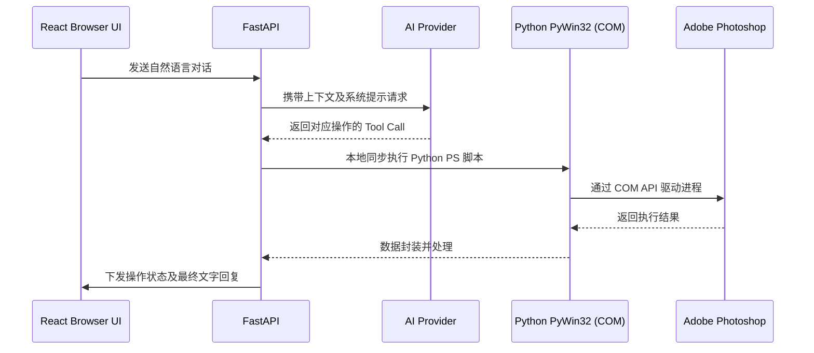
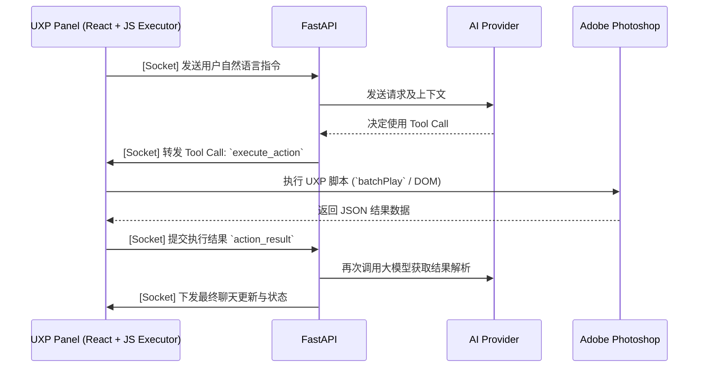

# UXP 插件集成架构研究 (UXP Operations Research)

## 1. 架构目标与上下文
本研究针对当前项目 (PS AI Assistant) 中引入 UXP (Unified Extensibility Platform) 插件及能力的架构设计。
**当前架构**: 外部 React 前端 + FastAPI (Socket.IO) 核心调度 + Python COM (`pywin32`) Photoshop 操作执行。
**目标需求**: 整合 UXP 能力，通过更现代的 `batchPlay` 和原生 DOM API 扩展/替代受限的 COM 接口，支持更丰富的图层、画布及文档管理功能，并为新特性铺平道路。

## 2. 核心集成点 (Integration Points)

引入 UXP 将在以下几个维度与现有系统产生深度集成：

1. **执行引擎集成 (Execution Engine)**: 
   - 将原有在 FastAPI 侧同步执行的 Python COM 逻辑，改造为异步事件机制。
   - UXP 作为宿主执行器，接收来自后端的 Tool Call 指令，通过 `require("photoshop").action.batchPlay` 或原生 DOM API 与 Photoshop 宿主进行低延迟内网级交互。
2. **通信层集成 (Transport Layer)**:
   - UXP 运行时原生支持 WebSocket 及 `fetch` 接口。UXP 插件可以通过 Socket.IO-client 与当前的 FastAPI Socket.IO Server 建立持久化长链接。
3. **前端 UI 集成 (UI/Frontend)** *(建议项)*:
   - 现有的 React UI 聊天界面可直接构建打包放入 UXP Panel 环境中运行。
   - 外部浏览器独立控制台将转变为 Photoshop 内置原生面板，用户体验完全沉浸化，无需在两个窗口间频繁切换。

## 3. 组件变更对照 (New vs Modified Explicit)

| 组件类别 | 组件名称 | 状态 | 详细说明 |
| :--- | :--- | :--- | :--- |
| **New** | **UXP Plugin 容器** | 新增 | 包含 `manifest.json`，提供 Photoshop 内置扩展面板的入口，持有宿主应用运行上下文。 |
| **New** | **JS Execution Layer** | 新增 | 位于 UXP 内部的业务逻辑层，实现所有面向 PS 的图层/画布操作脚本（替代原先由 `pywin32` 承载的职责）。 |
| **Modified** | **FastAPI 后端** | 修改 | **剥离与重路由**: 移除本地依赖 Windows 环境的 `pywin32` 调用，改造为 "接收到大模型 Tool Call 请求后，向下游 UXP 客户端下发 Socket 指令并等待响应"。 |
| **Modified** | **Socket.IO 事件字典** | 修改 | **新增事件机制**: 引入双向 RPC。例如 `execute_action` (Backend -> UXP), `action_result` (UXP -> Backend)。 |
| **Modified** | **React UI 面板** | 修改 | 基础组件(聊天气泡、配置面板)大部分可复用。只需修改构建目标与网络请求的相对路径，以适配 UXP 运行时环境限制。 |

## 4. 数据流变更 (Data Flow Changes)

### 现有基于 COM 的数据流 (Current Data Flow)

### 引入 UXP 后的数据流 (New Data Flow)

> [!NOTE]
> 该流向转变意味着**执行权下放**：FastAPI 后端将彻底解绑 Windows 与本地进程依赖，转型为纯粹的 AI 网关、会话与记忆管理中枢。所有的 Photoshop 业务执行操作闭环均在前端 UXP 内完成。

## 5. 建议的构建顺序 (Suggested Build Order)

为了平滑过渡并降低迁移风险，结合现有依赖情况建议采取以下实施步骤：

1. **Phase 1: UXP 骨架脚手架搭建** *(基础依赖)*
   - 在项目内新建 UXP 目录，配置 `manifest.json` 与基础入口 (`main.js` / `index.html`)。
   - 使用 Adobe UDT (UXP Developer Tool) 确保能在 Photoshop 中挂载一个 "Hello World" 的空白面板。
2. **Phase 2: 通信桥梁打通** *(依赖 Phase 1)*
   - 引入支持 UXP 环境的 Socket.IO 客户端 SDK。
   - 使 UXP 插件启动时主动连接现有 FastAPI 后端，实现简单的双向 Ping-Pong 事件验证连通性。
3. **Phase 3: UXP 操作执行层构建 (PoC)** *(依赖 Phase 2)*
   - 选取 1~2 个不复杂的 COM 功能（如：读取当前所有图层结构）。
   - 在 UXP 侧使用原生 JS DOM API 实现同样的逻辑，并通过 Socket 监听来自后端的触发指令。
   - 后端针对这 1~2 个特定 Tool，修改为异步派发给 Socket 客户端，并等待回调。
4. **Phase 4: 全量 COM 逻辑 UXP 化替换** *(依赖 Phase 3)*
   - 遍历现有基于 `pywin32` 的全部工具函数（裁剪、调色、获取图片快照等），全部转译为 UXP JS (`batchPlay`)。
   - 后端全面下线并清理 `pywin32` 依赖，重构 Tool Call 的派发中心。
5. **Phase 5: React UI 原生化迁移** *(可选，依赖 Phase 4)*
   - 将原本浏览器运行的 React 应用的组件迁移整合进入 UXP Panel 中。
   - 打磨 UI 样式适配 Photoshop 黑暗/明亮主题，完成一体化插件转型。
